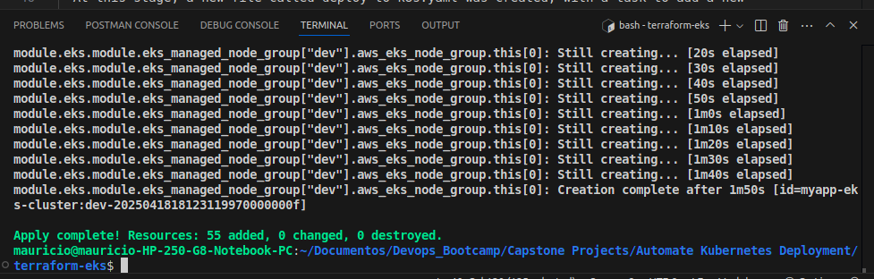
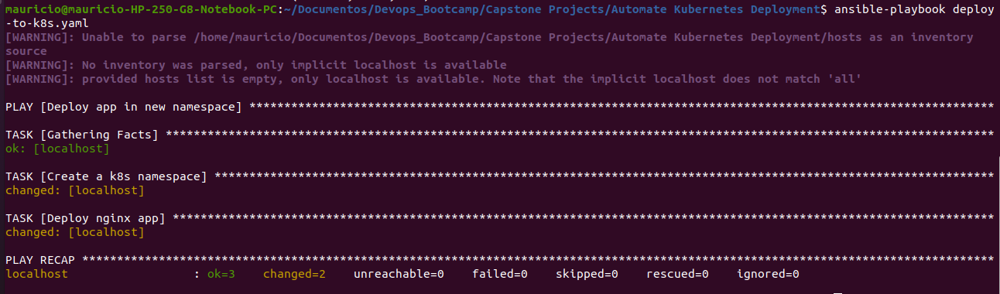

# Demo Project 

Automate Kubernetes Deployment

## Technologies Used

Ansible, Terraform, Kubernetes, AWS EKS, Python, Linux

## Project Description

- Create EKS cluster with Terraform
- Write Ansible Play to deploy application in a new K8s namespace

### Details of project   

- Create EKS Cluster with Terraform

  In this module, a Kubernetes (EKS) cluster was created using a Terraform script located in terraform-eks folder. The following commands were run inside this folder:

  ```
    terraform init
  ```
  This command initializes the terraform project, downloading the necessary provider plugins, sets up the backend, the modules and prepares the .terraform folder.

  ```  
    terraform apply 
  ```

  This command shows the plan and if approved, executes those changes in the infrastructure. There are 55 resources created here. To get more details about these resources creation, please check the explanation in this link, in Demo Project 3: 
  
  https://github.com/Mauricio-Camilo/devops-bootcamp-m12-terraform

    

- Create Namespace in EKS Cluster

  To interact with the created cluster, the kubeconfig file was generated using the following command:

  ```sh
    aws eks update-kubeconfig --region us-east-1 --name myapp-eks-cluster --kubeconfig /path-to-file/kubeconfig_myapp-eks-cluster
  ```
  This command updates the kubeconfig file to allow kubectl and Ansible to communicate with the EKS cluster.

- Creating the Playbook

  At this stage, a new file called deploy-to-k8s.yaml was created, with a task to add a new namespace to the cluster using the previously configured kubeconfig file.

  ```sh
    - name: Deploy app in new namespace
    hosts: localhost
    tasks:
        - name: Create a k8s namespace
        kubernetes.core.k8s:
            name: my-app
            api_version: v1
            kind: Namespace
            state: present
            kubeconfig: /home/mauricio/Documentos/kubeconfig_myapp-eks-cluster
  ```
- Python Module Requirements

  To run Kubernetes modules with Ansible, the following Python libraries must be installed locally:

    - Kubernetes >= 12.0.0
    - PyYAML >= 3.11
    - jsonpatch

  These libraries enable Ansible to interact with the Kubernetes API.

  With these configurations, the namespace can be created running the command:

  ```sh
    ansible-playbook deploy-to-k8s.yaml
  ```

- Verifying Namespace Creation

  After executing the playbook, the namespace was successfully created and verified using:

  ```sh
    kubectl get namespaces
  ```
- Deploy App in New Namespace

  The next step was to create a simple NGINX deployment in the newly created namespace using Ansible.

  ```sh
    - name: Deploy nginx app
    kubernetes.core.k8s:
        src: /home/mauricio/Documentos/k8s-nginx.yaml
        state: present
        kubeconfig: /home/mauricio/Documentos/kubeconfig_myapp-eks-cluster
        namespace: my-app 
  ```
  In order to make this step, a deployment called k8s-nginx.yaml was created, which is a simple nginx configuration to be deployed in a kubernetes cluster

  This task deploys NGINX to the my-app namespace in the EKS cluster.

  Then, the playbook was runned again:

  ```sh
    ansible-playbook deploy-to-k8s.yaml
  ```  
    

- Verifying the Deployment

  After running the playbook successfully, the following command was used to get the service URL:

  ```sh
    kubectl get svc -n my-app
  ```
  The service URL can be accessed in the browser to confirm that NGINX is running correctly.

    

- Simplifying Kubeconfig Management

To simplify the playbook, the kubeconfig path can be exported as an environment variable:

  ```sh
    export K8S_AUTH_KUBECONFIG=/home/mauricio/Documentos/kubeconfig_myapp-eks-cluster
  ```
This way, the playbook doesn’t need to explicitly define the kubeconfig path, making the code cleaner and more maintainable.

